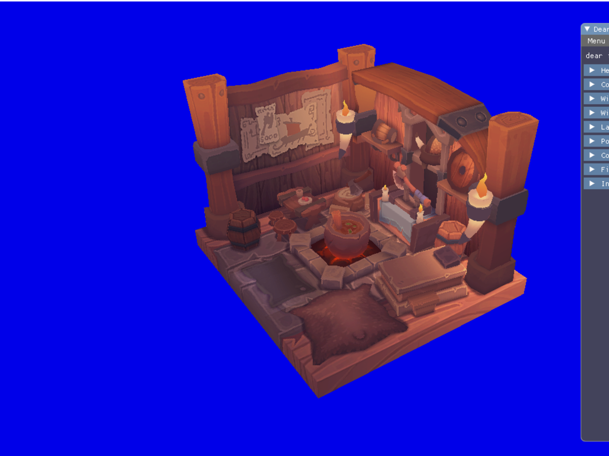

# vulkan_start_point
这是一个学习vulkan的初级项目，这是旧的文件，我创建这个库用来保留之前的学习项目，清缓存，本地的文件不留了。
主体框架来自于[vkguide](https://vkguide.dev)。  



## 
<details><summary>设计理念和想法</summary>
<p>

## 间接绘制和Bindless
#### 间接绘制 vkCmdIndirectDraw(...)
减少直接的drawCall，能交给GPU的统统交给GPU.在GPU的缓冲区中存放好命令，把参数和数据提前放在一个大SSBO中，计算着色器执行的时候去调用。
#### **Bindless**
bind越少越好，BindVertexBuffer、BindIndexBuffer、BindPipeline 和 BindDescriptorSet 调用会让CPU慢下来，效率不高.

</p>

</details>

## 
<details><summary>编译</summary>
<p>

### Cmake+Win10+VS2019
使用CmakeGUI编译，新建一个build文件夹，编译后的文件解决方案文件将存放在build文件夹下.  
**注意:** 需要手动指定SDL库的路径PATH:xxx/xxx/SDL2.2.0.8，这里使用SDL2.2.0.8版本，如果需要使用assimp库还需要加载assimp库文件，我的repo没有包括，建议使用vcpkg导入assimp库

</p>
</details>


## 
<details><summary>文件说明</summary>
<p>

<details><summary>asset-baker</summary>
<p>

## asset-baker
asset_main.cpp文件可以制作一个名为baker.exe的asset生成器。asset生成器主要是制作渲染所需的一些资产，这些资产的格式能够提高引擎加载的速度。
asset_main.cpp里都是一些模型解析函数,这部分都是我从相关的库偷来的:grin: .......然后自己修改了一部分来满足我自定义的asset格式。  

#### 支持的asset格式
texture有基本的.png,.jpg, 模型有gltf和fbx
#### 生成的asset格式(** 自定义格式 **)
texture全部生成.tx格式，材质material生成.MAT格式，网格生成.MESH格式
#### 制作过程
直接编译asset-main.cpp文件注意，这里需要一些库:: assimp,tinyGLTF,nvtt......,其中nvtt库生成可能会报错，然后需要手动将nvtt.dll库放到baker.exe文件旁。
**注意:** assimp库必须先由vcpkg导入，nvtt库需要手动制作nvtt.dll，制作nvtt.dll不要使用Cmake,直接进入nvtt库文件夹下找到.sln文件编译，编译会报错，但能够生成复合本项目要求的nvtt.dll.  

baker.exe会出现在新建的bin文件夹下
#### 生成资产
baker..exe需要nvtt.dll库，请将nvtt.dll库放到baker.exe同一目录
cmd 打开 baker.exed的目录，将存放gltf或者fbx模型的文件夹复制，执行```baker.exe <folder directory> ```

</p>
</details>

##
<details><summary>assetlib</summary>
<p>

## assetlib

根据[vkguide](https://vkguide.dev)的提示,使用压缩和解压缩后的二进制文件加载asset会更快，设计了主要的AssetFile格式，相应的封装了texture,material,mesh,prefab四种新的文件组织格式

根据不同的资产类型的封装格式，设计一些读取封装信息read_xxx_info函数，pack_xxx,unpack_xxx函数负责解包和打包

主要用到了LZ4的作为压缩和解压缩工具[LZ4](https://github.com/lz4/lz4),JSON格式的解析使用了[nlohmann](https://github.com/nlohmann/json)。
AssetFile：
```
//assert meta file structure
	struct AssetFile {
		//type mean: assert type include:mesh texture and material
		char type[4];//MESH TEXT MATX PRFB
		int version;
		std::string json;//assert(mesh,texture,material detail info
		std::vector<char> binaryBlob;//compressed data(mesh vertex,texture pxiel...) 
	};
```

Texture(Material Mesh Prefab类似):
```
struct TextureInfo {
		uint64_t textureSize;
		TextureFormat textureFormat;//RBGA8
		CompressionMode compressionMode;//None, LZ4

		std::string originalFile;//original file path
		std::vector<PageInfo> pages;//pages info
	};
 ```
 </p>
 </details>
 
 ##
<details><summary>assets</summary>
<p>

## assets
这里放了一些我自己测试使用的资产文件，前三个文件夹时glft模型文件，可以从这：[GLTF](https://github.com/KhronosGroup/glTF-Sample-Models)下载。
 最后一个asset_export是使用baker.exe制作自定义资产格式的输出文件，引擎将优先从里加载资产
 </p>
 </details>
 
 ##
 <details><summary>dudu—engine</summary>
 <p>
 
## dudu-engine
 
 主要的engine文件都在这里，包括几个大方面
 ### engine
 vk_engine.cpp包含了一些vulkan的初始化，imgui的创建，资产加载，场景初始化，以及渲染过程.   
 vk_engine_scenerender.cpp是具体的渲染过程函数这部分需要和vk_scene.cpp结合。  
 ### scene
 vk_scene.cpp是一个重要的预处理文件，在实现简介绘制和bindless之前，需要提前将所有的资产和处理流程打包，这是用scene部分不负责完成的，将所有的资产和流程打包封装好后，可以交给vk_engine_scenerender.cpp处理。
 ### textture,material,mesh
 vk_texture.cpp负责加载texture,优先从assets_export加载AsserFile文件.  
 vk_mesh.cpp负责加载mesh,以及一些简单预处理函数，例如计算包围盒，法线封装(八面体)。  
 material_system.cpp,这个文件很重要与vk_scene.cpp和vk_shader.cpp关系密切，负责一些简单渲染管线的生成和提前构建效果模板。  
 ### initialization,descriptor,pushbuffer,play_camera
 vk_initializers.cpp vulkan有太太太多的对象结构需要填充信息，独立出一个initializer负责初始化，这是很常见的步骤。  
 vk_descriptor.cpp 将描述符相关的对象进行封装，以便快速的构建描述符集和布局。  
 vk_pushbuffer.cpp 对于需要单独推送一些buffer给GPU,使用这个文件中的函数，特别是imgui需要展示的信息，例外这里面有意一个数据对齐函数很重要，来自[SaschaWillems](https://github.com/SaschaWillems/Vulkan/tree/master/examples/dynamicuniformbuffer)。  
 play_camera.cpp 就是运动相机功能，与SDL库结合处理相机运动
 ### cvars和profiler
 cvars.cpp 是一个全局的控制变量系统，相关知识可以从这里：[CVARS](https://vkguide.dev/docs/extra-chapter/cvar_system/)获取。  
 vk_profiler.cpp 是debug所需要的一部分函数,需要一个库[Tracy Profiler](https://github.com/wolfpld/tracy)，负责探查不同处理流程的耗时，类似于监控帧率。  
 ### shader
 vk_shader.cpp 负责加载shader模型以及反射spv文件，需要一个库[SPIRV-Reflect](https://github.com/KhronosGroup/SPIRV-Reflect)。
 spv反射能解决很大部分手里劳动:grin:   

</p>
</details>

##
<details><summary>libs</summary>
<p>

## libs

不多，就放了imgui和nvtt的lib文件

</p>
</details>

##
<details><summary>shaders</summary>
<p>

## shaders

放了glsl格式shader文件，.spv文件是通过CmakeList命令编译出来的，把shader文件后缀写成.vert,.frag或者.comp即可。  


</p>
</details>

</p>
</details>

##
## 感谢开源库:grin:  
 
GUI调试： [Imgui](https://github.com/ocornut/imgui)。   。  
着色器库： [glm](https://github.com/g-truc/glm)  。   。   
图像加载： [stb_image](https://github.com/nothings/stb)  。  
OBJ文件加载： [tinyObjLoader](https://github.com/tinyobjloader/tinyobjloader)  。    
AMD的Vulkan内存管理： [VMA](https://github.com/GPUOpen-LibrariesAndSDKs/VulkanMemoryAllocator)  。  

